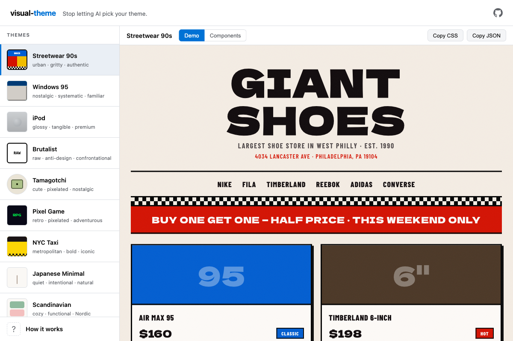
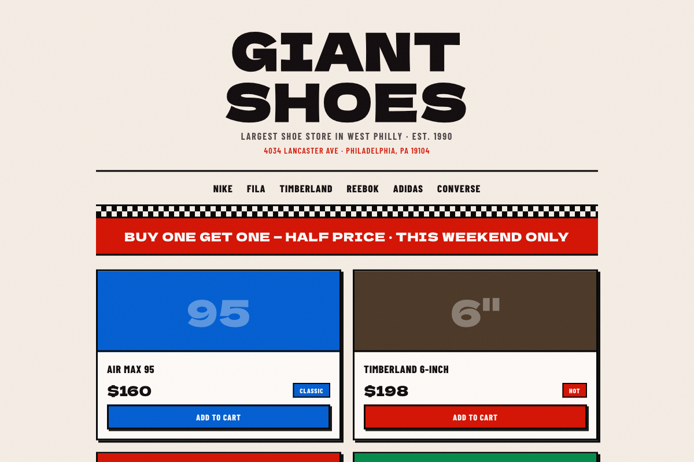
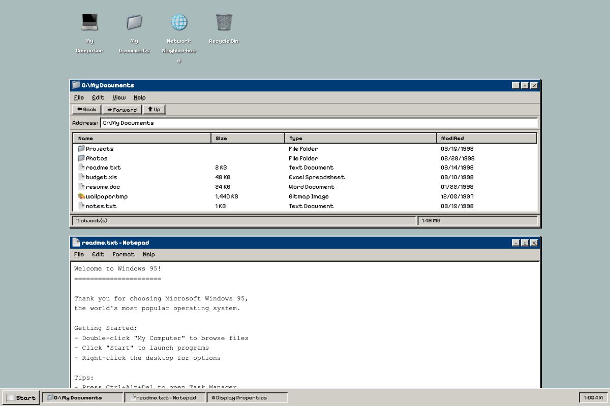
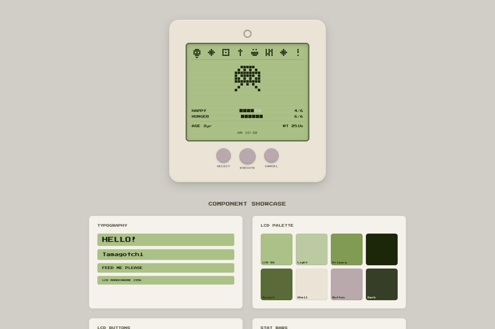
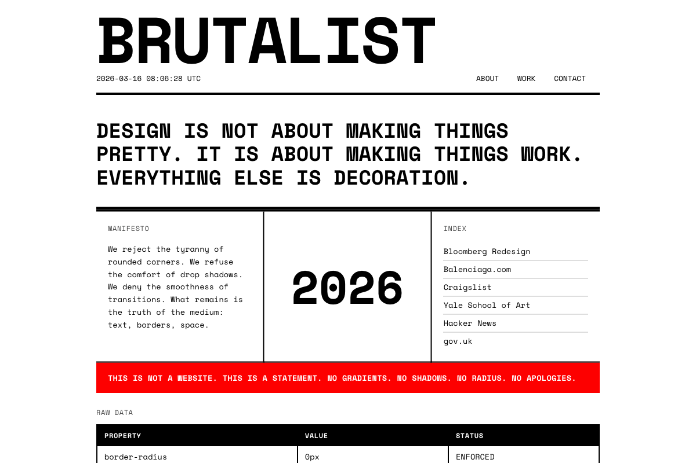
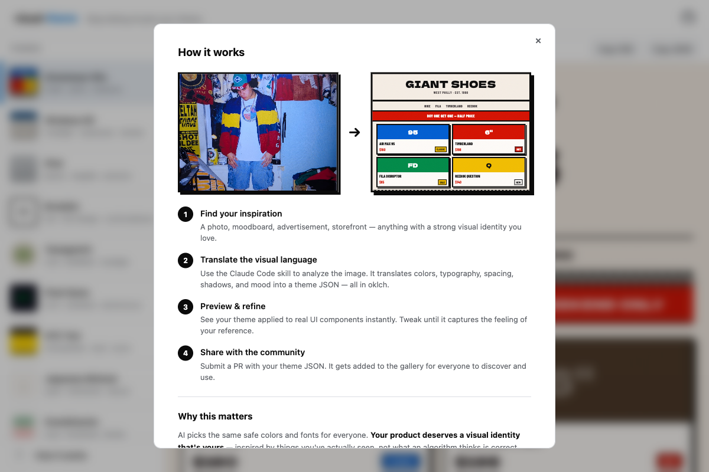

# visual-theme

Stop letting AI pick your theme. Design themes inspired by real-world visual references — not generic AI defaults.



<p align="center">
  <a href="https://kenehong.github.io/visual-theme/">
    
  </a>
</p>

<p align="center">
  
  
</p>
<p align="center">
  
  
</p>

### How it works



## What is this?

A collection of design themes inspired by real-world visual references — vintage storefronts, neon signs, magazine ads, architecture, anything with a distinct visual identity.

Each theme is a JSON file with oklch color tokens, typography, spacing, shadows, and motion values that you can drop into any project.

## Themes

| Theme | Mood | Inspired by |
|-------|------|-------------|
| **Streetwear 90s** | urban · gritty · authentic | West Philly sneaker stores, graffiti, colorblock jackets |
| **Windows 95** | nostalgic · systematic · familiar | Microsoft Windows 95 UI, beveled borders |
| **iPod** | glossy · tangible · premium | Apple iPod click wheel era, skeuomorphic UI |
| **Brutalist** | raw · anti-design · confrontational | Raw HTML, anti-design movement |
| **Tamagotchi** | cute · pixelated · nostalgic | 90s virtual pet devices, LCD screens |
| **Pixel Game** | retro · pixelated · adventurous | 8-bit RPG games, pixel art |
| **NYC Taxi** | metropolitan · bold · iconic | New York City taxi cabs, checkered patterns |
| **Japanese Minimal** | quiet · intentional · natural | Wabi-sabi, Japanese stationery, tea ceremony |
| **Scandinavian** | cozy · functional · Nordic | Nordic interior design, natural materials |
| **Kids: Portrait** | raw · expressive · artbrut | Children's drawings, art brut |
| **Pop Art** | pop · graphic · bold | Comic books, Lichtenstein, halftone dots |
| **Vaporwave** | aesthetic · nostalgic · dreamy | 80s/90s retro-futurism, sunset gradients |
| **Manga** | dramatic · monochrome · kinetic | Japanese manga panels, screentone patterns |
| **Cyberpunk** | futuristic · electric · dystopian | Neon-lit cityscapes, sci-fi interfaces |
| **Art Deco** | glamorous · geometric · golden | 1920s architecture, Gatsby-era elegance |
| **Korean Menu** | nostalgic · handwritten · homestyle | Korean restaurant menus, handwritten prices |

## Use a theme

### CSS Custom Properties

```css
:root {
  --color-bg: oklch(95% 0.015 75);
  --color-primary: oklch(50% 0.2 255);
  --color-accent: oklch(55% 0.22 30);
  --font-sans: 'Barlow Condensed', sans-serif;
  --radius-md: 2px;
  --shadow-md: 4px 4px 0 oklch(15% 0 0);
}
```

Copy CSS directly from the gallery, or use the export utilities:

```js
import { toCSS, toTailwind, toFigmaTokens } from './lib/convert.js';
```

### Tailwind v4

```js
// Generated from theme JSON
export default {
  theme: {
    extend: {
      colors: {
        primary: 'oklch(50% 0.2 255)',
        accent: 'oklch(55% 0.22 30)',
      }
    }
  }
}
```

## Create your own theme

### With Claude Code

```bash
# Copy the agent skill
cp AGENT.md ~/.claude/skills/extract-theme.md

# Provide a reference image and extract
```

The skill analyzes images across 7 axes — color, typography, shape, depth, texture, motion, and mood — then translates them into a theme JSON with oklch tokens.

### Manual

See [THEME_FORMAT.md](THEME_FORMAT.md) for the JSON schema.

## Contribute

We want more themes! Create a theme from your favorite visual reference and submit a PR.

See [CONTRIBUTING.md](CONTRIBUTING.md) for the full guide.

## Format

Themes use the **visual-theme JSON format** — a portable design token spec built on oklch colors.

- [Full format specification](THEME_FORMAT.md)
- [Export utilities](lib/convert.js) (CSS, Tailwind, Figma Tokens)

## License

MIT
